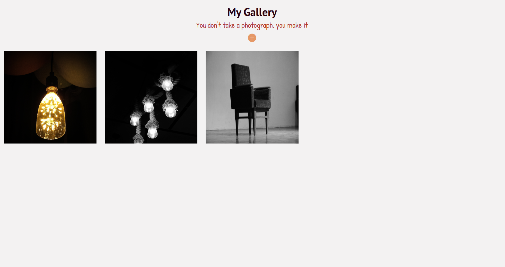
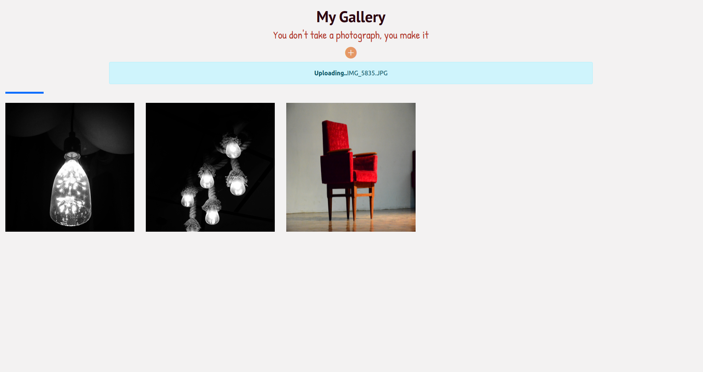

# Gallery

Personlized Photo Gallery created to upload and view images

# Work Flow

- React.JS has been used to serve the frontend for the portal which runs on http://localhost:3000/
- create-react-app has been used for initialising the react app

# Screenshots




# Installing

Clone the repository
```
git clone https://github.com/abhii30/Gallery.git Gallery
```

Change directory to /Gallery
```
cd Gallery
```

Install dependencies
```
npm install
```
Start compiliation
```
npm start
```
# Author

- #### Abhishek Kumar
